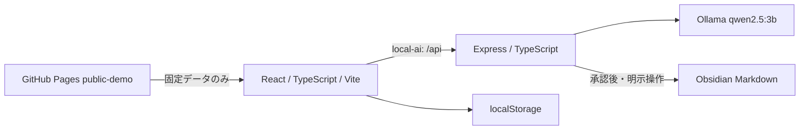

# AI OFFICE

AI OFFICEは、ローカルLLMを使って5名のAI社員へ仕事を依頼し、計画・成果物・人による承認・Obsidian保存までを一つの画面で扱うポートフォリオアプリです。React / TypeScript / ViteのUIと、Express / OllamaによるローカルAI処理を安全に分離して設計しています。

- **公開デモ（AI通信なし）**：[https://salt-417.github.io/ai-office/](https://salt-417.github.io/ai-office/)
- **GitHub**：[https://github.com/SALT-417/ai-office](https://github.com/SALT-417/ai-office)

| 実行モード | 用途 | AI・ローカルファイル |
| --- | --- | --- |
| `public-demo` | GitHub Pagesで画面設計と操作を確認する固定デモ | API通信、Ollama実行、Vault保存なし |
| `local-ai` | 自分のPCで実際にAI社員へ依頼する実働版 | Express経由でOllamaを利用。承認後のMarkdownをVaultへ保存可能 |

## この作品で示していること

- **UI設計**：React 19 / TypeScript / Vite 7によるレスポンシブUI、キーボード操作、ARIA、`prefers-reduced-motion`対応
- **API設計**：Express / TypeScriptによる入力検証、タイムアウト、キャンセル、利用者向けエラー、社員ごとの失敗分離
- **ローカルLLM連携**：Ollama `qwen2.5:3b`へサーバーから接続し、小型モデルの出力を実用的な業務UIへ統合
- **構造化出力**：JSON Schema、厳格な検証、安全な軽微正規化、最大1回の修正再試行、具体的なフォールバック
- **実行環境の分離**：GitHub PagesではAPIを呼ばず、ローカル版だけがExpress・Ollama・Obsidianへ接続
- **ブラウザ内データ管理**：localStorageをバージョン付きで検証し、履歴・承認状態・自分用テンプレートを復元
- **読み取り専用分析**：許可ファイル、path、symlink、サイズ、秘密値、根拠path・line、プロンプトインジェクションを検証
- **Obsidian連携**：YAML frontmatter付きMarkdown、手動ダウンロード、カテゴリ別Vault保存、任意のDailyノート追記
- **品質管理**：Vitest / React Testing Library、型チェック、ESLint、本番ビルドをGitHub Actionsでも実行

## 主な機能

- **リアル／ミニチュア表示**：既存の実写風オフィスと、CSS・Reactで構成した軽量な2.5Dミニチュアオフィスを切り替えられます。5モード、社員選択、作業状態はどちらの表示にも連動します。

### AI社員と業務カテゴリ

レン（全体計画）、ミオ（調査・キャリア）、ソウ（AI・Web開発）、ユナ（UI/UX・文章）、アキ（テスト・品質）の5名が担当します。一般業務、AI学習、ソフトウェア開発、転職・キャリア、コンテンツ・SNSのカテゴリに応じて、基本役割を保ちながら担当内容を切り替えます。

### 依頼テンプレート

各カテゴリ3件の固定テンプレートを用意しています。よく使う依頼は自分用テンプレートとしてブラウザへ保存でき、選択後も編集してから送信できます。テンプレート選択だけでは自動送信しません。

### ローカルAI実行

レンが依頼を整理して担当計画を作り、ミオ・ソウ・ユナ・アキのうち該当する社員がテキスト成果物を生成します。担当者と役割はクライアント値を信用せずサーバー側で決定し、1名の失敗で他社員の成果を失わない構成です。

### 作業履歴と承認

依頼、計画、成果物をlocalStorageへ最大20件保存し、未確認・承認・差し戻しと任意メモを記録できます。承認は状態の記録であり、ファイル変更やコマンド実行を開始する操作ではありません。

### 読み取り専用プロジェクト分析

利用者が明示的に選択した1〜8件の許可ファイルだけを、ソウまたはアキが分析します。結果は要約、重要度、根拠、改善案、完了条件、確認方法として表示し、分析履歴にも承認フローを適用します。

### Obsidian連携

作業履歴と分析履歴をObsidian向けMarkdownとしてコピーまたは`.md`ダウンロードできます。`local-ai`では承認済み履歴をカテゴリ別フォルダへ保存でき、希望した場合だけDailyノートへ短いログを追記します。画面の「Obsidian連携」パネルで現在の設定状態を確認できます。

### 公開デモ

GitHub Pagesでは、カテゴリ切替、固定テンプレート、自分用テンプレート、固定の計画・成果物・分析サンプルを操作できます。各結果には固定サンプルであることを表示し、実履歴へ自動保存しません。画面上部の「使い方ガイド」から公開版とローカル版の違いも確認できます。

## アーキテクチャ



- **Frontend**：React 19 / TypeScript / Vite 7
- **Local API**：Node.js / Express / TypeScript
- **LLM**：Ollama / `qwen2.5:3b`
- **Storage**：localStorage / Obsidian Markdown（データベースなし）
- **Test**：Vitest / React Testing Library
- **Deployment**：GitHub Pages（`public-demo`、`base: /ai-office/`）

## ローカルでの使い方（Windows / PowerShell）

必要なものはNode.js LTSと[Ollama](https://ollama.com/)です。

```powershell
ollama pull qwen2.5:3b
npm ci
npm run dev
```

[http://localhost:5173/ai-office/](http://localhost:5173/ai-office/)を開きます。`npm run dev`はViteとローカルExpress APIを同時に起動し、Viteから`/api`をExpressへプロキシします。終了は`Ctrl + C`です。

1. 業務カテゴリを選ぶ
2. 固定・自分用テンプレート、または自分の依頼文を入力する
3. 「レンに依頼する」で計画を作る
4. 「担当社員に実行してもらう」でテキスト成果物を作る
5. 履歴を人が確認・承認し、必要ならMarkdownまたはObsidianへ保存する

### 公開デモビルドの確認

```powershell
$env:VITE_APP_RUNTIME_MODE = "public-demo"
npm run build
npm exec vite preview -- --host 127.0.0.1
```

公開ビルドは静的な`dist`だけを生成し、Expressサーバーや秘密情報を含みません。

## Obsidian連携の設定

Vault保存は`local-ai`限定です。ブラウザからVaultの絶対パスや任意の保存先を送らず、ローカルExpressの環境変数だけで保存先を決定します。

| 環境変数 | 説明 | 既定値 |
| --- | --- | --- |
| `OBSIDIAN_VAULT_DIR` | 既存のObsidian Vault絶対パス。未設定ならVault保存は無効 | なし |
| `OBSIDIAN_EXPORT_SUBDIR` | Vault内のAI OFFICE保存先 | `AI OFFICE` |
| `OBSIDIAN_DAILY_NOTES_ENABLED` | `true`の場合だけ、利用者が選択した保存でDaily追記を許可 | `false` |
| `OBSIDIAN_DAILY_NOTES_SUBDIR` | Vault内のDailyノート保存先 | `Daily` |

```powershell
$env:OBSIDIAN_VAULT_DIR = "C:\Users\user\Documents\My Vault"
$env:OBSIDIAN_EXPORT_SUBDIR = "AI OFFICE"
$env:OBSIDIAN_DAILY_NOTES_ENABLED = "true"
$env:OBSIDIAN_DAILY_NOTES_SUBDIR = "Daily"
npm run dev
```

作業履歴は`AI OFFICE/一般業務`、`AI OFFICE/AI学習`、`AI OFFICE/開発`、`AI OFFICE/転職・キャリア`、`AI OFFICE/コンテンツ`へ、分析履歴は`AI OFFICE/分析`へ保存します。同名ファイルは上書きせず`-2`、`-3`の連番にします。Dailyには成果物全文ではなく、日時・担当・相対保存先・短いメモだけを末尾追記します。

履歴やMarkdownには秘密情報・個人情報が含まれる可能性があります。保存前に必ず内容を確認し、安全なVaultで管理してください。

## 安全設計

- GitHub Pagesは明示的な`public-demo`で、AI・分析・Obsidian APIを呼びません
- ブラウザからOllamaへ直接接続せず、入力検証とエラー秘匿を行うローカルExpressを経由します
- Vault保存とDaily追記は`local-ai`限定かつ利用者の明示操作時だけです
- Vault絶対パスはサーバー環境変数で固定し、ブラウザへ返しません
- ファイル名、サブフォルダ、realpath、symlink / junctionを検証し、Vault外への保存を防ぎます
- 読み取り専用分析は許可リスト内のテキストファイルだけを対象にし、サイズと件数を制限します
- 秘密鍵、APIキーらしい値、Bearerトークン、パスワード代入をOllamaへ渡す前に伏字化します
- ファイル内の文章は命令ではなく分析データとして扱い、プロンプトインジェクションに従いません
- 構造化出力はpath、line、文字数、役割、内容品質までサーバーで検証し、不正時は安全なフォールバックを使用します
- AI出力は提案です。人が承認しても、Git操作、コマンド実行、ファイル変更、外部送信は自動実行しません

## テストと品質確認

実装時点で**234件のVitestテスト**が成功しています。

```powershell
npm run typecheck
npm run lint
npm run test
npm run build
git diff --check
```

主なテスト対象は、5モードと社員選択、進捗・localStorage復元、カテゴリとテンプレート、API入力検証、成功・失敗・タイムアウト・キャンセル、StrictMode、構造化出力とフォールバック、履歴・承認、読み取り専用分析、Obsidian保存、Daily追記、公開版のAPI非通信、キーボード操作と安全なHTML文字列表示です。

`.github/workflows/deploy.yml`はNode.js LTSで`npm ci`、型チェック、ESLint、Vitest、本番ビルドを実行し、すべて成功した場合だけ公式GitHub Pages Actionsで`dist`を公開します。Secretsや外部APIキーは不要です。

## プロジェクト構成

```text
src/
  components/        画面と操作単位のReactコンポーネント
  data/              社員、固定テンプレート、公開サンプル
  hooks/             API通信、履歴、カテゴリ、localStorage状態
  types/             フロントエンドの型
  utils/             保存検証、Markdown変換、実行モード判定
server/
  app.ts              Expressルート
  manager.ts          レンの計画生成と担当者判定
  work.ts             専門社員の成果物生成
  project-analysis.ts 読み取り専用分析と安全検証
  obsidian.ts         Vault保存、Daily追記、状態判定
shared/
  workCategories.ts   フロント・サーバー共通のカテゴリ定義
```

## ポートフォリオとしての説明

> ローカルLLMを安全に業務UIへ組み込み、公開デモと実働環境の分離、構造化出力の再検証、失敗時フォールバック、履歴と人による承認、読み取り専用コード分析、Obsidian連携までを一貫して設計・実装しました。

面接では、機能数だけでなく「小型モデルの不安定な出力をどこまでコードで制御するか」「静的ホスティングで実働機能を誤認させない方法」「ローカルファイルを扱う際に、パス・秘密情報・明示操作をどう守るか」を技術判断として説明できます。

## ライセンス・素材

背景画像と5名のキャラクター画像は本プロジェクト用の承認済み素材です。無断での再配布・再利用は避けてください。
